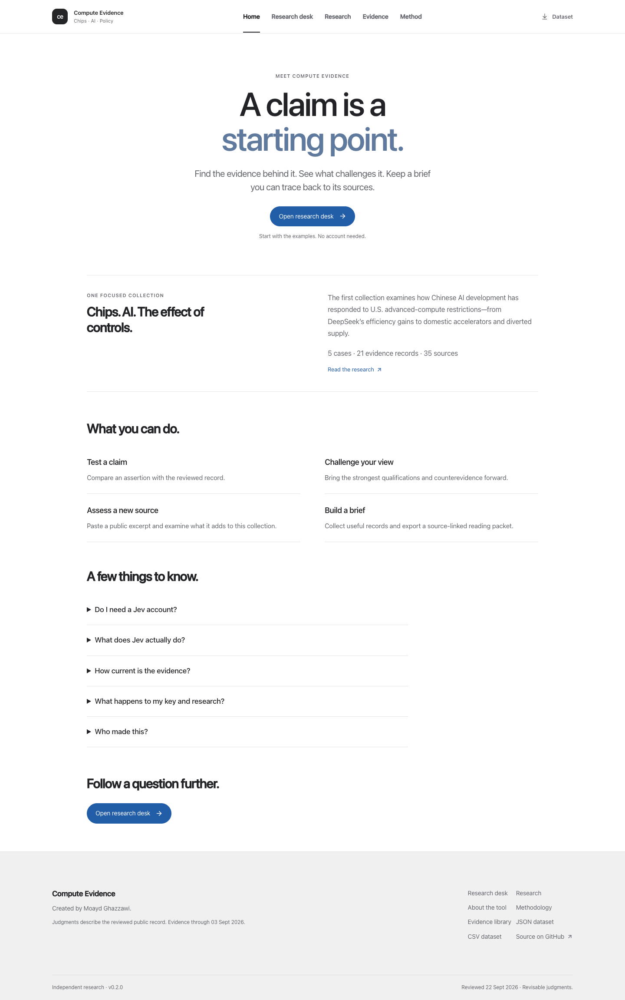
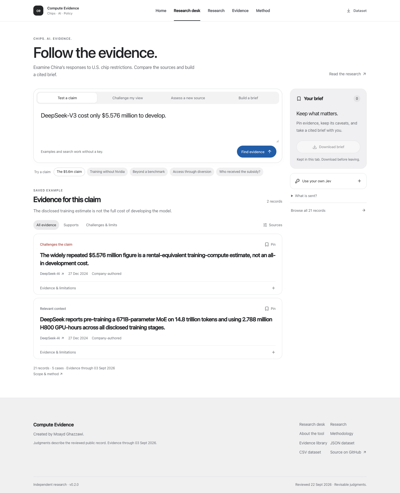
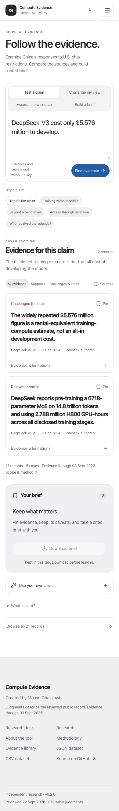

# Compute Evidence

**A research tool by Moayd Ghazzawi.** Test claims, examine counterevidence, and build cited briefs.

The first research collection is *When Controls Raise the Cost: China’s Responses to U.S. Advanced-Compute Restrictions*.

> Status: Compute Evidence publication release · research dataset version 0.2.0<br>
> Evidence reviewed through: 3 September 2026<br>
> Targeted research review and tool redesign: 22 September 2026

[Live research site](https://compute-evidence.moaydghazzawi.com) · [Public GitHub repository](https://github.com/moaydghazzawi/when-controls-raise-the-cost)

The public product is Compute Evidence. The original `when-controls-raise-the-cost.moaydghazzawi.com` address redirects page visits to the new domain, preserving paths and query parameters. Requests from already-open research desks continue on their original origin.

This project asks:

> Since October 2022, which Chinese responses have actually weakened U.S. controls on advanced AI chips, and which have only made Chinese AI development more expensive, slower, or more dependent on outside technology?

It is a standalone, citation-backed evidence ledger for comparing technical adaptation, domestic substitution, systems engineering, rerouted access, and state support. It is designed for policy researchers and technically informed readers who want every judgment connected to inspectable sources, counterevidence, confidence, and unresolved questions.

## Current finding

**One vendor-reported case weakens direct accelerator denial. None establishes broad supply-chain independence.**

The record supports useful adaptation, narrow functional substitution and enforcement leakage. It does not establish broad supply-chain independence or measure how much extra cost the controls caused.

- DeepSeek-V3 shows that algorithm and systems design can stretch a restricted Nvidia H800 fleet.
- Huawei reports that Pangu Ultra, a very large model, was trained on thousands of domestic Ascend accelerators, weakening the narrow claim that top U.S. accelerators are indispensable.
- CloudMatrix384 shows that systems engineering can recover useful inference performance by pooling many weaker devices.
- Operation Gatekeeper shows material diversion of controlled H100 and H200 accelerators.
- Chinese tax preferences and local compute support show that public support exists, but the reviewed record does not connect that support to a named recipient’s restored capability or net cost.

The evidence is more consistent with controls imposing friction and shifting costs than with either an absolute technological blockade or complete policy failure.

## Product contents

The homepage introduces Compute Evidence and opens the research desk at `/desk`, with four actions: test a claim, challenge a view, assess a new public source, and build a cited brief. Five saved examples, keyword search, source filters, manual evidence selection, and Markdown exports work without an account. Visitors can optionally use their own TypeSafe key for custom Jev judgments. No owner credential is deployed or used as a fallback.

The original case explorer, matrix, and timeline are at `/research`; old case/filter/anchor links redirect there. `/evidence` retains searchable source records and subset exports, `/methodology` explains the research standard, and `/` introduces the tool (`/about` redirects to it). All views use one canonical research dataset. See [research desk architecture and privacy](docs/research-desk.md).

- Eight-event policy timeline beginning with the October 2022 controls
- Five structured response cases
- The same six-question test applied to every case
- Twenty-one evidence records with claims, locations, counterevidence, confidence, and uncertainty
- Thirty-five sources; thirty-three are primary for the narrow claim recorded
- Four explicit judgment classes
- Filters for response type, date, source type, confidence, and dependency
- Downloadable JSON and CSV
- Dedicated methodology, limitations, and “What would change my mind?” sections
- Automated schema, citation, transformation, build, accessibility, interaction, download, and responsive-layout checks

## Current case matrix

| Response                      | Case                                        | Judgment                        | Confidence | Dependency finding           |
| ----------------------------- | ------------------------------------------- | ------------------------------- | ---------- | ---------------------------- |
| Compute efficiency            | DeepSeek-V3 on Nvidia H800                  | Adaptation + cost penalty       | Moderate   | Foreign-controlled hardware  |
| Domestic substitutes          | Pangu Ultra MoE on 6,000 Ascend NPUs        | Narrow control-point weakening  | Moderate   | Reduced; upstream unresolved |
| Systems engineering           | CloudMatrix384 serving DeepSeek-R1          | Adaptation + cost penalty       | Moderate   | Reduced; upstream unresolved |
| Rerouted access               | Operation Gatekeeper GPU diversion network  | Circumvention, not independence | Moderate   | Foreign access route         |
| Stockpiling and state support | Tax preferences and local compute subsidies | Insufficient evidence           | Low        | Unknown                      |

“Narrow control-point weakening” is deliberately narrow. The Pangu finding applies to the direct finished-accelerator control point; it does not establish independence from HBM, fabrication equipment, packaging, design software, optics, or other upstream inputs.

## Method

Every case receives the same questions:

1. What AI capability was restored, and on which tasks?
2. Can it work repeatedly at useful scale?
3. What extra hardware, electricity, money, engineering, or time does it require?
4. Does it reduce dependence on technology controlled by the United States or its allies?
5. Could a realistic enforcement change break the workaround?
6. Can it support the next generation of development, or only current needs?

Cases then receive one of four provisional judgments:

- **Narrow control-point weakening:** capability is restored at useful scale while dependence falls at the targeted control point.
- **Adaptation + cost penalty:** capability coexists with substantial resource demands or controlled foreign-hardware dependence. This qualitative label is not an estimate of the causal cost premium imposed by controls.
- **Circumvention, not independence:** access bypasses enforcement but remains tied to controlled foreign technology and a disruptable route.
- **Insufficient evidence:** the public record cannot connect the response to restored capability, useful scale, or a particular rule.

These are research judgments, not legal determinations.

## Evidence standard

The source hierarchy favors official rules and records, technical disclosures and repositories, independent evaluation, specialist analysis, and then careful reporting where primary material is unavailable.

Every evidence record includes:

- Claim
- Source and source type
- Publication and access dates
- Relevant quotation or data
- Exact source location
- Counterevidence
- Confidence
- Remaining uncertainty
- Whether the record supports, qualifies, or counters the claim

A source marked `primary` is original or official for the recorded proposition. That does not mean the proposition has been independently verified.

## Important limitations

- Exact chip inventories, acquisition dates, yields, energy use, subsidies, and total engineering costs are usually private.
- Pangu Ultra and CloudMatrix performance evidence is vendor-authored and has not been independently reproduced at full scale.
- Benchmarks mix algorithms, data, hardware, and implementation choices; they do not isolate the causal effect of export controls.
- Enforcement cases reveal detected schemes, not the prevalence of undetected diversion or the capability ultimately produced.
- The control regime changed repeatedly, so each response must be matched to the rule and license policy in force at the relevant time.
- This study is selective rather than exhaustive. It favors inspectable evidence and labels missing facts rather than estimating them.

The project describes export-control policy for research purposes and is not legal advice.

## Run locally

Requirements:

- Node.js 22.13 or later
- pnpm 11.19.0
- Python 3.9+ for audit tooling/tests; `pypdf` for optional PDF source capture
- No paid service, account, or API key required for browsing, examples, briefs, or tests; custom Jev assessments require the visitor’s own TypeSafe API access

```bash
corepack enable
corepack prepare pnpm@11.19.0 --activate
pnpm install --frozen-lockfile
pnpm dev
```

Open the local URL printed by the development server, normally `http://localhost:3000`.

Build and run the production worker locally:

```bash
pnpm build
pnpm start
```

## Validation and tests

Run data checks, unit tests, lint, and the production build:

```bash
pnpm verify
```

Install Playwright’s Chromium once, then run the browser suite:

```bash
pnpm exec playwright install chromium
pnpm test:browser
```

The browser suite checks desktop and mobile layouts, accessibility, console errors, evidence filters, permalinks, exports, visitor-key handling, explicit request behavior, source-assessment provenance, cancellation, reduced motion, security headers, and the existing research workflows. Jev tests use fictional keys and mocked provider responses; they make no paid calls.

Refresh the signed-off repository screenshots explicitly:

```bash
pnpm test:screenshots
```

The normal browser suite does not rewrite tracked screenshots.

Against an already running local preview on port 3001 with system Chrome:

```bash
pnpm test:browser:local
```

Individual data commands:

```bash
pnpm check:schema
pnpm check:citations
pnpm check:data
pnpm check:links
pnpm test
pnpm lint
pnpm build
```

The original 33 source URLs were checked on 3 September 2026. Two additional primary sources were inspected on 11 September; existing source access dates remain unchanged. A targeted update is not a claim that every policy or source was comprehensively rereviewed. `check:links` is intentionally not part of CI because third-party availability and bot policies can make network checks nondeterministic.

The 22 September targeted review added an optional [Jev evidence audit](docs/jev-evidence-audit.md), corrected Pangu's 58.7% improvement to refer to MFU rather than throughput, clarified DeepSeek training-stage and quotation wording, made CloudMatrix's batch-size trade-off explicit, and repaired the Hangzhou policy citation. Only manually reviewed records have new access dates; the comprehensive evidence cutoff remains 3 September.

Run `pnpm audit:evidence` to prepare a private source-support report and reuse cached results. `pnpm audit:evidence --live` explicitly calls TypeSafe for uncached inputs; source capture and credential setup are described in the audit guide. This optional workflow is separate from CI and the public website.

## Data

The canonical source is [`data/research.json`](data/research.json). Generated public files are:

- [`public/data/research-dataset.json`](public/data/research-dataset.json)
- [`public/data/evidence.csv`](public/data/evidence.csv)

See [`docs/data-and-source-dictionary.md`](docs/data-and-source-dictionary.md) for field definitions, controlled vocabulary, reference rules, and CSV mappings.

To update the record:

1. Edit `data/research.json`.
2. Keep every claim scoped and sourced; record counterevidence and uncertainty.
3. Update source access dates only after inspecting those sources. `meta.reviewedOn` records a targeted review; advance `meta.evidenceThrough` only after updating the covered period.
4. Run `pnpm check:schema`, `pnpm check:citations`, and `pnpm build:data`.
5. Inspect the JSON/CSV diff and run `pnpm verify` plus `pnpm test:browser`.

## Project structure

```text
app/                               Site routes and global styles
components/                        Interface and evidence-exploration components
data/research.json                 Canonical research dataset
docs/data-and-source-dictionary.md Dataset contract and provenance rules
docs/screenshots/                  Tested desktop and mobile previews
public/data/                        Generated downloadable datasets
scripts/                            Validation and transformation commands
tests/                              Unit and browser quality gates
website-summary.md                 Draft portfolio copy and source links
LICENSE-RECOMMENDATION.md          Proposed code/content licensing split
.github/workflows/ci.yml           Continuous integration
```

## Screenshots







## What would change the finding

- Repeated, independently audited frontier-scale training on domestically fabricated accelerators with disclosed HBM, yield, power, cost, and production volume
- Metered CloudMatrix deployments showing total-cost and power parity, not only throughput or per-TFLOPS efficiency
- Evidence that diversion or offshore access reliably supplies next-generation compute after realistic customer, ownership, and data-center checks
- Audited firm-level evidence showing no material delay, redesign, inventory drawdown, or cost increase after a matched rule change
- Conversely, documented project delays, unmet accelerator demand, falling training scale, or sustained upstream shortages

## Roadmap

- Add independent replication or audit evidence for Pangu Ultra and CloudMatrix
- Improve like-for-like power, cost, reliability, and hardware-count comparisons
- Add a foreign-cloud case only when provider, workload, timing, and legal route are adequately documented
- Connect subsidy and stockpiling claims to named recipients and capability outcomes
- Track rule-status changes without overwriting historical context
- Expand only when a case can pass the same evidence standard

## Privacy and publication status

The redesigned release has completed local verification and is approved for publication. See [release verification](docs/release-readiness.md). Production requires no owner TypeSafe key or additional storage binding. A live paid provider call was deliberately not used for verification; request/response contracts and error paths are exercised with mocks against the current documented API.

The owner has approved public publication. The repository and live site are public. Private background documents, planning notes, credentials, conversations, and unrelated files remain excluded.

The private research-direction document used as background during development is outside this repository. It is not copied, quoted, committed, or published.

## License

No open-source license has been applied. Public visibility alone does not grant an open-source license; no broad reuse permission should be inferred until the owner selects and applies a license.

The recommended approach is MIT for original code and CC BY 4.0 for original research prose and structured data, with third-party material excluded. See [`LICENSE-RECOMMENDATION.md`](LICENSE-RECOMMENDATION.md).
